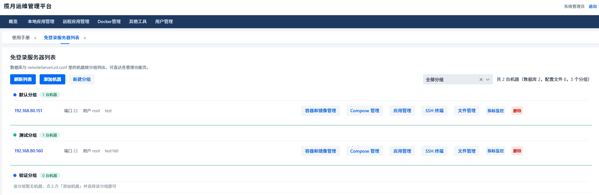
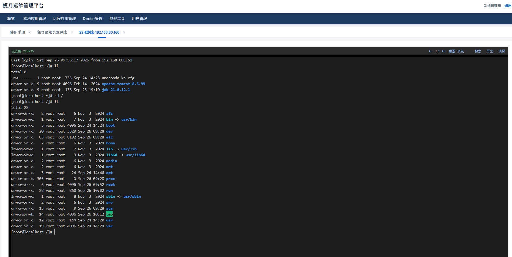
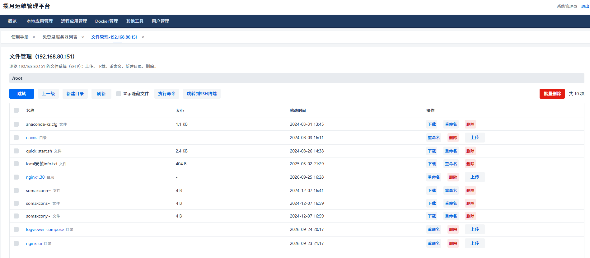
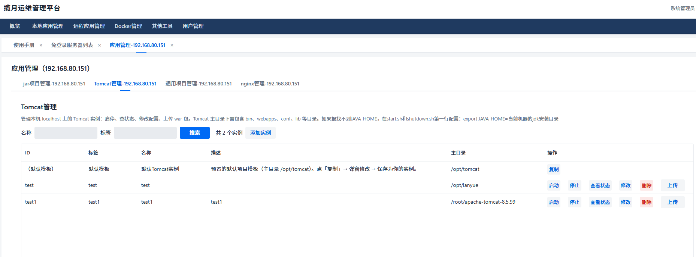
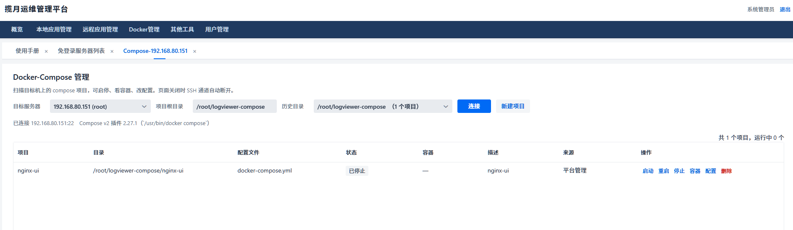
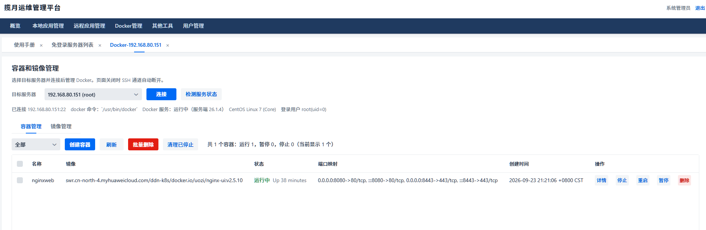
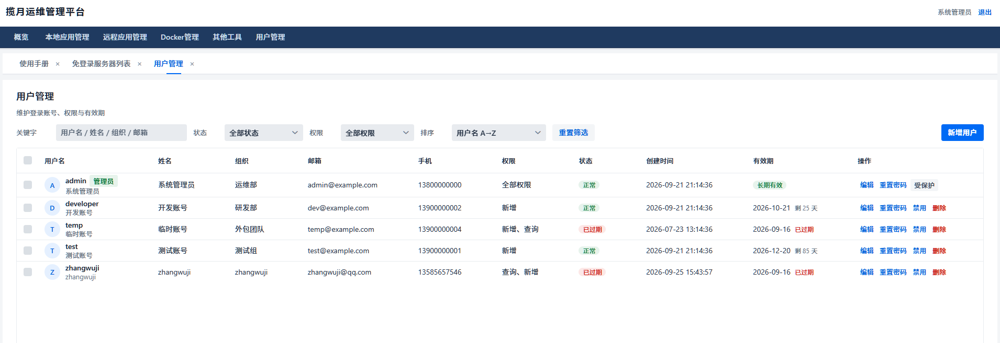

# 揽月运维管理平台（lanyue）

一套面向中小团队的自助运维平台：Web 页面上完成服务器管理、日志搜索、文件管理、应用发布、Docker / Docker-Compose 管理和 SSH 终端操作，不必再挨个登录机器敲命令。

基于 **Spring Boot 3.5 + Vaadin 24** 构建，单 jar 部署，同时兼容 **SQLite**（开箱即用）和 **MySQL 8** 两种数据库。



---

## 目录

- [功能总览](#功能总览)
- [系统架构](#系统架构)
- [快速开始](#快速开始)
- [配置说明](#配置说明)
- [默认账号](#默认账号)
- [目录结构](#目录结构)
- [常见问题](#常见问题)

---

## 功能总览

### 远程应用管理

**免登录服务器列表** —— 集中管理所有远程主机（SSH 账号密码 / 密钥），按分组组织。每台机器提供六个行内入口：

| 入口 | 说明 |
| --- | --- |
| 容器和镜像管理 | 远程 Docker 容器 / 镜像的查看、启动、停止、删除 |
| Compose 管理 | docker-compose 项目的启停、配置编辑、新建项目 |
| 应用管理 | 按预设命令执行应用的启动 / 停止 / 重启 / 状态检查 |
| SSH 终端 | 浏览器内原生终端（xterm.js + WebSocket），支持字号、主题切换 |
| 文件管理 | SFTP 文件浏览，上传、下载、重命名、删除、在线编辑 |
| 指标监控 | CPU / 内存 / 磁盘采样，进程 TOP 10，5 秒自动刷新 |

**远程日志搜索** —— SSH 到远程机器 grep 日志文件，在线查看匹配详情。

### 本地应用管理

- **本地日志搜索**：搜索本机日志文件，支持按关键字、时间范围过滤，详情页高亮展示。
- **本地文件管理**：本机文件浏览与编辑，纯文本文件（扩展名白名单内）直接在浏览器里改，配 CodeMirror 编辑器，按文件类型自动切换高亮模式（yaml / nginx / shell / properties 等）。
- **jar 项目管理**：登记本机 jar 应用，一键启动 / 停止 / 重启，跟踪运行状态。
- **Tomcat 管理**：Tomcat 实例的部署与管理。
- **通用项目管理**：以"主机 + 项目"为维度登记任意应用，自定义启停命令和状态检测关键字（如 nginx）。

### Docker 管理

- **容器和镜像管理**：容器生命周期操作、日志查看、进入终端；镜像列表与清理。
- **Docker-Compose 管理**：扫描远程主机上的 compose 项目，支持项目新建（多文件 YAML 编辑器）、启动 / 重启 / 停止、配置 diff、历史目录切换。

### 其他工具

- **加密工具**：常用摘要与对称加密算法，含国密 SM3 / SM4（BouncyCastle）。
- **脚本管理**：集中保存常用运维 shell 脚本，一键下发执行。

### 用户与权限

- 基于 Spring Security 的登录认证，密码使用 BCrypt 存储（存量 SM3 摘要在登录时自动渐进升级）。
- 菜单与操作按权限码控制（QUERY / UPDATE / ADD / ALL）。
- 用户管理页面支持账号的增删改、有效期设置（到期自动禁用）与权限分配。

### 界面速览

**SSH 终端**（xterm.js，浏览器内直接操作远程机器）：



**文件管理**（SFTP 上传下载、重命名、批量删除、跳转终端）：



**应用管理**（预设启停命令，一键执行）：



**Docker-Compose 管理**（扫描项目、一键启停、在线改配置）：



**镜像管理**：



**用户管理**：



---

## 系统架构

```
┌────────────────────────────────────────────────────────────┐
│                        浏览器                               │
│        Vaadin 24 服务端渲染 UI + xterm.js 终端              │
└──────────────┬──────────────────────────┬──────────────────┘
               │ HTTP（会话认证）          │ WebSocket
┌──────────────▼──────────────────────────▼──────────────────┐
│                   Spring Boot 3.5（内嵌 Tomcat，9095）      │
│                                                            │
│  ┌──────────┐ ┌──────────┐ ┌──────────┐ ┌───────────────┐  │
│  │ UI 层    │ │ 安全层   │ │ 服务层   │ │ WebSocket 端点│  │
│  │ Vaadin   │ │ Spring   │ │ Docker / │ │ /ws/ssh       │  │
│  │ View 组件│ │ Security │ │ Compose /│ │ /ws/docker    │  │
│  │ MenuReg. │ │ SM3+BCrypt│ │ 日志/文件│ │ 终端令牌鉴权  │  │
│  └──────────┘ └──────────┘ └──────────┘ └───────────────┘  │
│         │              │            │                      │
│  ┌──────▼──────────────▼────────────▼───────────────────┐  │
│  │  MyBatis-Plus（分页插件按连接 URL 自动判定方言）      │  │
│  │  HikariCP 连接池                                     │  │
│  └──────┬───────────────────────────────────────────────┘  │
└─────────┼──────────────────────────────────────────────────┘
          │
   ┌──────▼──────┐    ┌─────────────────────────────────┐
   │ SQLite /    │    │ 远程主机（SSH 连接池复用）       │
   │ MySQL 8     │    │  JSch：SFTP / 远程命令 / pty    │
   │ 双方言兼容   │    │  sshj：远程文件管理             │
   └─────────────┘    │  docker / docker-compose CLI   │
                      └─────────────────────────────────┘
```

关键设计点：

- **前端零独立部署**：Vaadin 服务端渲染，前端 TypeScript（CodeMirror 6 封装）由 Vite 构建打进 jar。
- **SSH 连接池**：所有远程操作复用 `SshConnectionPool`，避免频繁握手。
- **WebSocket 终端**：SSH 交互走 `/ws/ssh`，握手自带会话认证，另加一次性终端 token 校验。
- **数据库双兼容**：SQL 方言差异收敛在 `com.sl.db.DatabaseDialect`，业务代码不出现库名判断；分页插件从连接 URL 自动判定方言。
- **日志统一 Log4j2**：所有 Spring Boot starter 的默认 logback 已显式排除，配置见 `log4j2.xml`。

技术栈清单：

| 层 | 组件 |
| --- | --- |
| UI | Vaadin 24.10、CodeMirror 6、xterm.js、ECharts |
| 后端 | Spring Boot 3.5.0、Spring Security、Java 21 |
| 数据 | MyBatis-Plus 3.5.12、HikariCP、SQLite / MySQL 8 |
| 远程操作 | JSch（mwiede fork）、sshj、docker CLI |
| 工具 | Hutool、FastJSON2、Apache POI（Excel 导出）、BouncyCastle（国密） |

---

## 快速开始

### 环境要求

- JDK 21+
- Maven 3.9+（Node 环境由 Vaadin 插件自动准备）
- 目标机器如需远程管理：开放 SSH（22 端口），安装 docker / docker-compose（可选）

### 开发模式运行

```bash
mvn spring-boot:run
```

启动后访问 `http://localhost:9095/log`。默认激活 `dev` profile（SQLite），首次启动自动建库建表（`demo.sql`，含演示数据），无需任何手工初始化。

> 首次构建会下载前端依赖，耗时较长属正常现象。

### 生产打包

```bash
mvn clean package -Pproduction -DskipTests
java -jar target/lanyue-1.0-SNAPSHOT.jar
```

`-Pproduction` 会在 compile 阶段执行 `build-frontend`，把前端资源编译进 jar。生产 jar 不要用 dev 模式的默认 profile 之外的配置启动前先阅读下方配置说明。

### 切换 MySQL 8

```bash
java -jar lanyue.jar --spring.profiles.active=mysql
```

MySQL 的建库、建表、导数据有一份完整的操作清单，见 [`src/main/resources/application-mysql.properties`](src/main/resources/application-mysql.properties) 文件内注释。

---

## 配置说明

所有配置位于 `src/main/resources/`：

| 文件 | 作用 |
| --- | --- |
| `application.properties` | 主配置：端口、上下文路径、公共数据源参数、MyBatis、上传限制 |
| `application-dev.properties` | dev profile：SQLite 数据源 |
| `application-mysql.properties` | mysql profile：MySQL 8 数据源（含完整迁移注释） |
| `log4j2.xml` | 日志配置（唯一日志后端，禁止 logback） |
| `demo.sql` / `demo-mysql8.sql` | SQLite / MySQL 建表脚本（改一处必改另一处） |

### 核心配置项

```properties
# 端口与上下文路径（访问地址 http://host:9095/log）
server.port=9095
server.servlet.context-path=/log

# profile 切换：dev=SQLite，mysql=MySQL 8
spring.profiles.active=dev

# 上传大小限制（文件管理用）
spring.servlet.multipart.max-file-size=200MB
spring.servlet.multipart.max-request-size=300MB
```

### 在线文件编辑白名单

哪些远程文件允许在浏览器里直接编辑，由这两项控制：

```properties
# 允许编辑的扩展名（不区分大小写，逗号分隔）
pure.text.type=text,markdown,md,yml,yaml,conf,ini,log,csv,properties,sql,xml,html
# 单文件大小上限，支持 B/K/M/G 后缀
pure.text.type.maxsize=10M
```

### SQLite / MySQL 的选择

- **SQLite（dev）**：零配置，`demo.db` 文件即数据库，已开 WAL 模式。适合单机、小团队、演示环境。连接池固定 8 个连接（SQLite 单写多读，开大无益）。
- **MySQL 8（mysql）**：适合多人并发使用。连接池 16，URL 参数已按 Connector/J 9 最佳实践配置（utf8mb4、批量重写、时区）。建库时字符集**必须用 utf8mb4**，应用启动时会自动检查并告警。

---

## 默认账号

首次启动 `demo.sql` 会预置演示账号（详见脚本内注释）：

| 账号 | 说明 | 权限 |
| --- | --- | --- |
| `admin` | 系统管理员，由 `DbInitializer` 每次启动兜底保证存在 | ALL |
| `test` / `developer` / `guest` / `temp` | 演示账号，覆盖不同权限与有效期场景 | 各不相同 |

内置账号的初始口令请向项目维护者获取，或直接用 admin 登录后在「用户管理」中重置。密码以摘要（SM3 / BCrypt）存储，数据库泄露不等于口令泄露。

---

## 目录结构

```
lanyue/
├── src/main/java/com/sl/
│   ├── Application.java          # 入口（@Push 全局配置也在这里）
│   ├── ui/                       # Vaadin 界面层
│   │   ├── MainView.java         # 主框架（菜单 + 多标签页）
│   │   ├── MenuRegistry.java     # 菜单静态定义（分组 / 权限）
│   │   ├── component/            # 通用组件（UiFactory、CodeEditor、Dialogs…）
│   │   ├── local/                # 本地应用管理各页面
│   │   ├── remote/               # 远程应用管理各页面
│   │   ├── docker/               # Docker / Compose 页面
│   │   ├── admin/                # 用户管理
│   │   └── tool/                 # 加密工具、脚本管理
│   ├── docker/                   # Docker / Compose 服务层
│   ├── security/                 # 认证授权（SM3 → BCrypt 渐进迁移）
│   ├── db/                       # 数据库方言抽象
│   ├── config/                   # MyBatis、安全、文件上传等配置
│   ├── controller/               # WebSocket 端点（SSH / Docker 终端）
│   ├── mapper/  entity/          # MyBatis-Plus 数据访问层
│   └── util/                     # 工具类
├── src/main/frontend/            # 前端 TS（CodeMirror 6 封装等）
├── src/main/resources/           # 配置、建表脚本、日志配置
├── img/                          # README 截图
└── pom.xml
```

---

## 常见问题

**Q：启动后访问 9095 端口没反应？**
确认访问路径带上下文：`http://localhost:9095/log`，直接访问根路径会 404。

**Q：新增依赖后启动报 SLF4J 多 provider 警告？**
新依赖传递引入了 `spring-boot-starter-logging`（logback）。本项目唯一日志后端是 Log4j2，需在 `pom.xml` 给该依赖加 exclusion，参考 pom 中已有依赖的写法。

**Q：远程机器连不上？**
检查 SSH 端口、账号密码 / 密钥，以及防火墙。连接信息在「免登录服务器列表」中配置，支持密码和密钥两种认证方式。

**Q：从 SQLite 切到 MySQL 后老数据还在吗？**
不在。两个库独立，迁移步骤（建库 → 建表 → 逐表搬数据 → 切 profile）见 `application-mysql.properties` 内的六步清单。密码摘要与库无关，搬过去即可正常登录。
